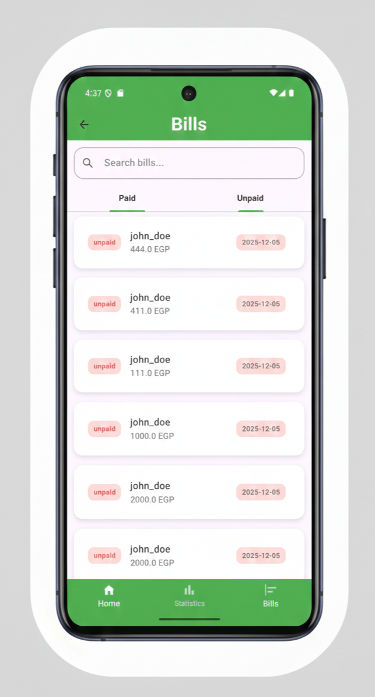
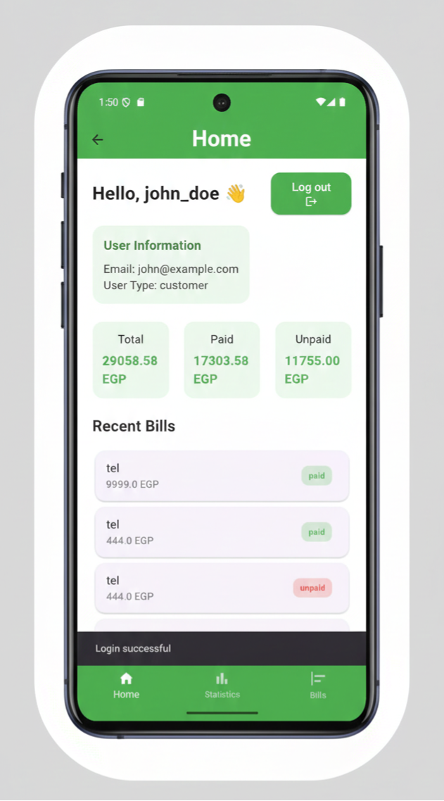
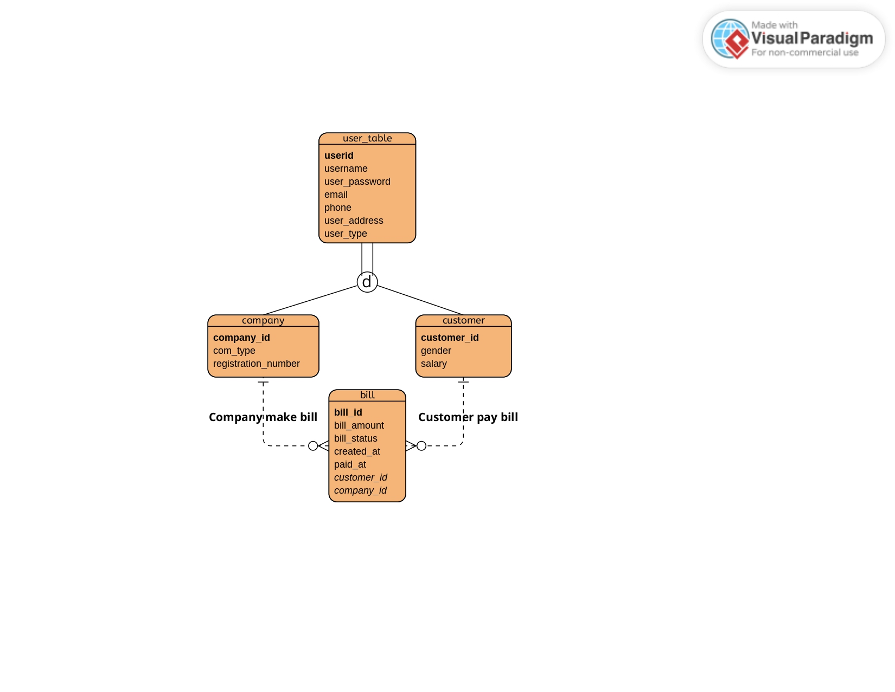
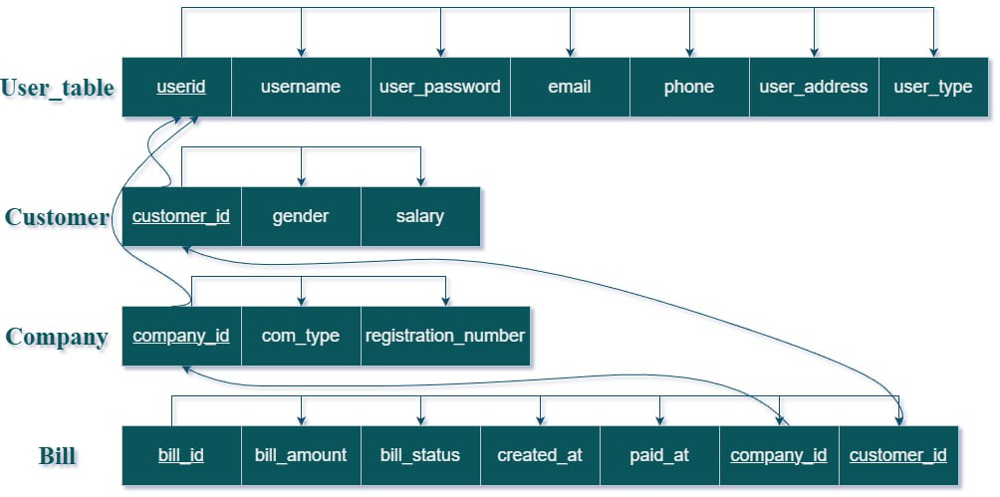

# Money Mate: Secure Bill Management Mobile App

[](https://flutter.dev/)
[](https://nodejs.org/)
[](https://expressjs.com/)
[](https://www.microsoft.com/en-us/sql-server)
[](https://jwt.io/)

**Money Mate** is a full-stack mobile application that revolutionizes
bill management between customers and service companies (telecoms,
utilities, banks, etc.).\
Built with **Flutter** for beautiful cross-platform UI and **Node.js +
Express + SQL Server** for a secure, scalable backend.

## App Screenshots

<div align="center">
  <table>
    <tr>
      <td align="center"><strong>Login / Register</strong></td>
      <td align="center"><strong>Company Bills</strong></td>
      <td align="center"><strong>customer Dashboard</strong></td>
    </tr>
    <tr>
      <td></td>
      <td></td>
      <td></td>
    </tr>
    <tr>
      <td align="center"><em>Secure JWT-based login</em></td>
      <td align="center"><em>Filter, search & pay bills</em></td>
      <td align="center"><em>pay bills & view Statistics</em></td>
    </tr>
  </table>
</div>

## Features

### **All Users**
-   Secure login/register with JWT token authentication\
-   View all bills (paid/unpaid filter + search by name)\

### **Customers**

-   One-tap bill payment\
-   Personal stats dashboard (day/week/month/year)\
-   Real-time bill updates

### **Companies**

-   Add bills to customers using email lookup\
-   View issued and collected bills\
-   Revenue statistics by period\
-   Secure role-based access

## Project Structure

    Money-Mate-Project/
    ├── api/                          # Backend
    │   ├── server.js
    │   ├── .env                      # (in .gitignore)
    │   ├── package.json
    │   └── src/
    │       ├── config/database.js
    │       ├── middleware/authMiddleware.js
    │       └── routes/
    │           ├── auth.js
    │           ├── bills.js
    │           ├── search.js
    │           └── stats.js
    ├── lib/                          # Flutter frontend
    │   ├── main.dart
    │   ├── screens/
    │   ├── services/
    │   └── models/
    ├── database/
    │   └── schema.sql                # Table creation 
    ├── pubspec.yaml
    └── README.md

## Quick Start

### **Backend (API)**

``` bash
cd api
npm install
```

Create `.env`:

    DB_USER=sa
    DB_PASS=YourStrongPass123
    DB_SERVER=localhost
    DB_NAME=Billing
    DB_INSTANCE=SQLEXPRESS
    JWT_SECRET=your_very_long_random_secret_key_here_123456789
    JWT_EXPIRATION=7d
    PORT=3000

Run database scripts from `database/` in SSMS → creates tables + mock
data.

Start server:

``` bash
npm run dev
```

API runs at: **http://localhost:3000**

### **Flutter App**

``` bash
flutter pub get
```

Update API URL in `lib/services/api_service.dart`:

``` dart
static const String baseUrl = "http://10.0.2.2:3000/api"; // Android emulator
// or: http://YOUR_PC_IP:3000/api for physical device
```

Run app:

``` bash
flutter run
```

## Database Design – EERD & Table Mapping

<div align="center">

**Enhanced Entity-Relationship Diagram (EERD)**  



<br><br>
**Maping / Tables**


</div>

## Contributors

<div align="center">

<div align="center">

<table>
  <tr>
    <td align="center" width="20%">
      <a href="https://github.com/FearThePLOTO">
        
        <br><br>
        <strong>Abdallh Ashraf</strong>
        <br><sub>Project Leader & Backend Tester</sub>
      </a>
    </td>
    <td align="center" width="20%">
      <a href="https://github.com/Muhammadkhiry">
        
        <br><br>
        <strong>Muhammad Khiry</strong>
        <br><sub>Flutter Developer</sub>
      </a>
    </td>
    <td align="center" width="20%">
      <a href="https://github.com/hatemabd-elkarim">
        
        <br><br>
        <strong>Hatem Ayman</strong>
        <br><sub>Backend Developer</sub>
      </a>
    </td>
    <td align="center" width="20%">
      <a href="https://github.com/ZK53">
        
        <br><br>
        <strong>Muhammad Zakaria</strong>
        <br><sub>Flutter Developer</sub>
      </a>
    </td>
    <td align="center" width="20%">
      <a href="https://github.com/Muhammdaly">
        
        <br><br>
        <strong>Muhammed Aly</strong>
        <br><sub>Database Designer</sub>
      </a>
    </td>
  </tr>
</table>

<br>

<p>
  <em>Built with passion, teamwork, and a lot of coffee</em>
</p>

</div>
